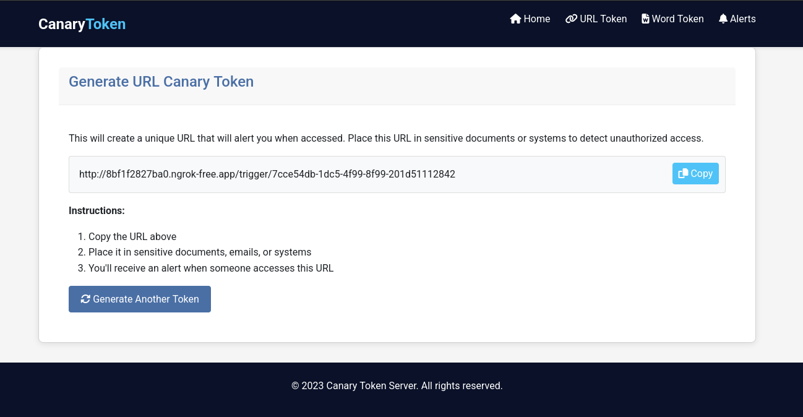
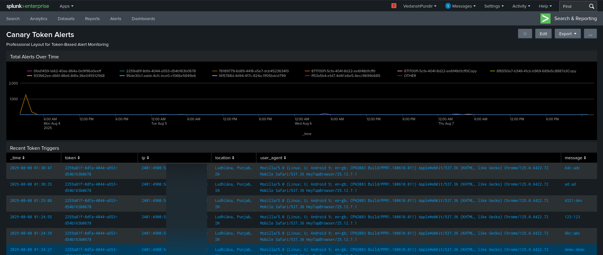
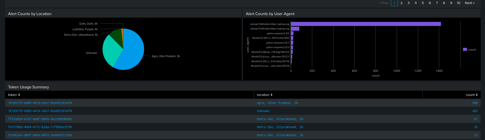
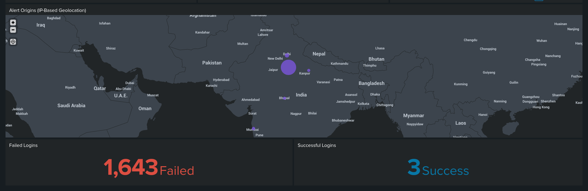

# DecoySentinel: Strategic Deception Powered by Splunk Analytics







## 📌 Overview

**DecoySentinel** is a strategic deception and real-time intrusion detection system designed to detect, alert, and analyze unauthorized access attempts on sensitive documents. It leverages modern web technologies and enterprise-grade SIEM capabilities to provide advanced threat detection and response.

Built using **Flask**, **Tkinter**, and integrated with **Splunk**, the system monitors document access, identifies potential intrusions, and initiates automated security responses including alerts and IP blocking.

---

## 🚀 Features

- 📂 **Document Access Monitoring**  
  Detects unauthorized opening of sensitive files in real-time using Python GUI (Tkinter) triggers.

- 🌐 **Web-Based Alert System**  
  Real-time reporting via Flask backend and client-side alerts.

- 🌍 **IP Geolocation & User-Agent Fingerprinting**  
  Automatically extracts and logs intruder's IP details, location, and browser fingerprints.

- 📧 **Email Notifications**  
  Instant alerts sent to the administrator when a honeypot file is accessed.

- 🔄 **Splunk SIEM Integration**  
  Centralized log collection, correlation rules, and advanced analytics through Splunk dashboards.

- 🚫 **Dynamic IP Blacklisting**  
  Automated Splunk rules identify brute-force attempts and blacklist IPs dynamically.

---


---

## ⚙️ Tech Stack

- **Frontend**: HTML,CSS,JS (Decoy file GUI)
- **Backend**: Flask (Python)
- **Monitoring**: Splunk (SIEM), IP Geolocation API, Email Alerts
- **Scripting**: Python 3.x, Shell (optional for automation)

---

## 🧪 Setup Instructions

### 1. Clone the Repository
```bash
git clone https://github.com/VedanshPundir/canarytrigger.git
cd canarytrigger

